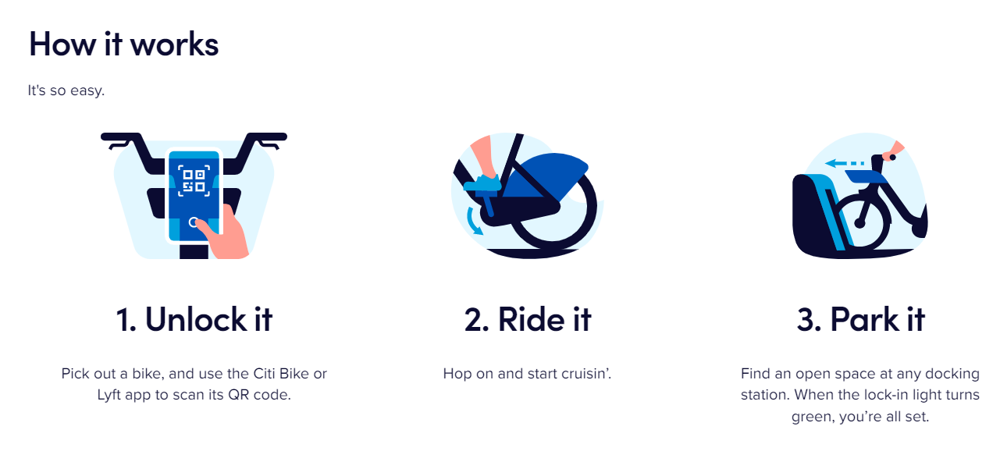
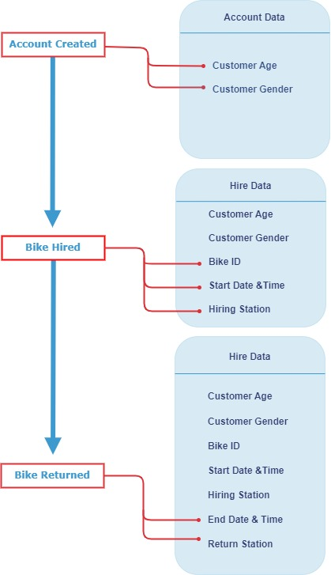

```{r setup, include=FALSE}
 
knitr::opts_chunk$set(warning = FALSE, message = FALSE, echo = FALSE) 

```

```{r}
library(tidyverse)
library(tsibbledata)
library(tsibble)
library(leaflet)
library(fontawesome)
nyc_bikes_df <- nyc_bikes
```

```{r}
nyc_bikes_df <- nyc_bikes_df %>% 
  mutate(
    start_year = year(start_time),
    start_month = month(start_time),
    start_day = day(start_time),
    start_wkday = wday(start_time, label = TRUE, abbr = TRUE),
    stop_year = year(stop_time),
    stop_month = month(start_time),
    stop_day = day(stop_time),
    stop_wkday = wday(stop_time, label = TRUE, abbr = TRUE),
    time_duration = as.duration(stop_time - start_time),
    time_duration = round(as.numeric(time_duration, "minutes"), digits = 2),
    start_date= make_date(start_year, start_month, start_day),
    stop_date= make_date(stop_year, stop_month, stop_day),
    start_hour = hour(start_time),
    stop_hour = hour(stop_time)
  )

```


<br>

## Domain Knowledge

<br>

CitiBikes is a bikesharing system operating in New York City, and is the largest bike sharing program in America despite only serving in one city.
CitiBike provides customers an affordable and environmentally friendly mode of transport by hosting banks of bicycles at various different "stations" across the city, that customers can "dock" in and out of with ease.
The scheme allows for a customer to hire their bicycle at any station in the city, and park their bike at any other station, allowing customers to get from A to B without having to worry about returning their bike.
The hiring process is completed entirely through an app, negating the need for opening times or manned stations.
CitiBikes possesses 25000 bikes and offers a range of bicycle styles including classic and electric bicycles, and has over 1500 stations across New York City.

<br>



<br>

<br>

--------------------------------------------------------------------------------

<br>

## Business Processes and Data Flow

<br>



Data is collected at the beginning and end of the hiring process.
In order to hire a bike, the customer must first create an account with CitiBike, this collects the customer's gender and age, amognst other personal details that have been left out of this dataset to allow anonymity.
Once the customer then chooses to hire a bike, the hire time, hire station, and bike ID are recorded.
Once the customer returns the bike at one of the docks, the stop time and stop station are recorded.

<br>

--------------------------------------------------------------------------------

<br>

## Data visualisation as a tool for decision-making

<br>

This report will provide insight into hiring patterns over time as well as hiring patterns across customer demographics.
These insights will allow CitiBikes to identify trends and relationships which will aid them to make informed decisions.

<br>

--------------------------------------------------------------------------------

<br>

## Data Quality and Bias

<br>

This data set has removed large areas of personal data that the app collects, such as phone number, name etc, so it is relatively anonymous.
Thanks to the small sample set, it would be difficult to create an individual profile for any one user based solely on rider patterns and so therefore I would say that this data set is fairly ethical as it has been filtered to preserve user anonymity.

<br>

------------------------------------------------------------------------

<br>

# Data Visualisations

<br>

**What is the pattern of bike hires over time?**

<br>

This data set provides a sample of the data over a span of the year.
Therefore, I deemed it most notable to understand the trend of data on a weekly to daily basis.
To provide further insight, it would be useful to sample data from other years to be able to gather better insight to the month to year trends.

```{r}
nyc_bikes_df %>% 
  index_by(start_wkday) %>%
  group_by(type) %>% 
  summarise(mean = mean(n())) %>% 
  ggplot(aes(x = factor(start_wkday, 
                        level = c("Mon", "Tue", "Wed", "Thu", "Fri", "Sat", "Sun")), 
             y = mean, 
             fill = type)) +
  geom_col() +
  xlab("\nDay") +
  ylab("Hires\n") +
  labs(fill = "Type of Hire\n") +
  ggtitle(expression(underline("Average Daily Bike Hires by Hire Type"))) +
  theme_minimal() +
  scale_fill_manual(values = c("Subscriber" = "#343d72",
                               "Customer" = "#3d99ce")) +
  theme(plot.title = element_text(family = "sans", face = "bold", hjust = 0.5, colour = "#dd3239" ))+
       
  ylim(0,750)
```

<br>

This plot displays the average number of bikes hired on each day of the week.
Each bar is split by the "hire type", i.e does the customer pay a monthly subscription or do they pay as they go.
\n It is evident from this plot that the most popular day for CitiBikes is Tuesday.
There is a reduction of hires over the weekend, however the ratio of customer to subscriber moves to favour one-off ("customer") hires at the weekend.
<br> To provide further insight into this differing customer behaviour at the weekend versus during the week, I investigated the pattern of hires on an hourly basis, and compared weekday patterns to weekend patterns:

<br>

```{r}
nyc_bikes_df_day <- nyc_bikes_df %>% 
  mutate(day_type = ifelse(start_wkday %in% c("Sat", "Sun"), "Weekend", "Weekday")) %>% 
  group_by(day_type) %>% 
  index_by(start_hour) %>% 
  summarise(count = n()) 

nyc_bikes_df <- nyc_bikes_df %>% mutate(day_type = ifelse(start_wkday %in% c("Sat", "Sun"), "Weekend", "Weekday"))

nyc_bikes_df_day <- as.tibble(nyc_bikes_df_day) %>% 
  mutate(start_hour = str_pad(start_hour, 2, pad = "0")) %>% 
  mutate(start_hour = str_replace(as.character(start_hour), "00", "24")) %>% 
  mutate(label_text = ifelse(count %in% c(474, 377), paste0(start_hour,":00"), NA)) 

nyc_bikes_df_day %>% 
  ggplot(aes(x = start_hour, y = count, group = day_type, colour = day_type)) +
  geom_point() +
  geom_text(aes(label = label_text), vjust = -0.5, show.legend = FALSE) + 
  geom_line() +
  xlab("Hour") +
  ylab("Hires\n") +
  labs(colour = "Key\n") +
  ggtitle(expression(underline("Average Hourly Hires")))+
  
  theme_minimal() +
  scale_colour_manual(values = c("Weekday" = "#343d72",
                                 "Weekend" = "#3d99ce")) +
  theme(plot.title = element_text(family = "sans", face = "bold", hjust = 0.5, colour = "#dd3239", size = 12))+
  theme(plot.title = element_text(vjust = 2)) +
  theme(plot.subtitle = element_text(vjust = 5)) 
  
```

From this plot, weekday hires are mostly taken during peak commuting times at the start and end of the business day.
Weekend hires are much more linear throughout the middle of the day.
The data does not provide any further insight into the meaning of rider trips, but you could hypothesise from this data that most hires through the week come from commuters with subscription accounts, whereas at the weekend trips are more random throughout the day.

<br> <br>

**How do these patterns vary with ridertrips vary with age?**

<br>

Although we cannot tell much about the reason for riders' journeys, there are some insights that we can discover about the riders.

<br>

```{r}
colour_mapping <- rep(c("#3d99ce", "#343d72"), 26)
nyc_bikes_df %>% 
  index_by(birth_year) %>%
  group_by(type) %>% 
  filter(!birth_year %in% c(1887, 1888)) %>% # remove 2 rows containing impossible ages
  summarise(count = n()) %>% 
  ggplot(aes(x = birth_year, y = count, fill = type)) +
  geom_col() +
  ggtitle(expression(underline("Age Range and Type of Riders"))) +
  xlab("Year of Birth") +
  ylab("Riders") +
  labs(fill = "Purchase Type") +
  scale_x_continuous(n.breaks = 8) +
  theme(plot.title = element_text(family = "sans", face = "bold", hjust = 0.5, colour = "#dd3239", size = 12))+
  scale_fill_manual(values = colour_mapping)
```

<br>

We can deduce from this plot that most riders were in their 20s and 30s.
There is a large amount of users that have stated their year of birth as 1969, and the majority of these users are "one-off" customers rather than subscribers.

<br>

```{r}
nyc_bikes_df %>% 
  filter(!time_duration %in% 5479.65) %>%  # removes one outlier 
  index_by(birth_year) %>%
  group_by(day_type) %>% 
  summarise(avg_trip_duration = round(mean(time_duration), digits =2)) %>%  
  filter(!birth_year %in% c(1887, 1888)) %>% # remove 2 rows containing impossible ages
  ggplot(aes(x = birth_year, y = avg_trip_duration, fill = day_type)) +
  geom_col() +
  ggtitle(expression(underline("Average Duration of Trips per Age and Day"))) +
  xlab("Year of Birth") +
  ylab("Ride Duration (minutes)") +
  labs(fill = "") +
  scale_x_continuous(n.breaks = 8) +
  theme(plot.title = element_text(family = "sans", face = "bold", hjust = 0.5, colour = "#dd3239", size = 12))+
  scale_fill_manual(values = colour_mapping)
```

<br>

The majority of trips were less than 30 minutes, with the majority of longer trips happening at the weekend.
There is not much of a pattern with trip duration and age group, with a few random spikes across the plot.

------------------------------------------------------------------------

<br>

**What is the geographical spread of start points of bike hires?**

<br>

CitiBike hosts over 1500 stations across New York City.
This data set sampled 10 bikes, that visited 52 stations in total, with the majority of them concentrating in Jersey City.

```{r}
icon <- makeAwesomeIcon(icon = "bicycle", library = "fa", markerColor = "blue", iconColor = "red")
nyc_bikes_df %>%
  distinct(start_lat, start_long) %>% 
  leaflet() %>% 
  addTiles() %>% 
  addAwesomeMarkers(lng = ~start_long,
                    lat = ~start_lat,
                    icon = icon,
                    clusterOptions = markerClusterOptions(),
  )

```

<br>

It may be useful to know the most popular start and end points, as this may expose information about bike movements across the city.

<br>

```{r}
leaflet_data_top_5_start <- as.tibble(nyc_bikes_df) %>% 
  mutate(coord = paste(start_lat, start_long, sep = ", "), .after = start_long) %>% 
  group_by(coord, start_lat, start_long) %>% 
  summarise(count = n()) %>% 
  arrange(desc(count)) %>% 
  head(5)

leaflet_data_top_5_end <- as.tibble(nyc_bikes_df) %>% 
  mutate(coord_end = paste(end_lat, end_long, sep = ", "), .after = end_long) %>% 
  group_by(coord_end, end_lat, end_long) %>% 
  summarise(count = n()) %>% 
  arrange(desc(count)) %>% 
  head(5)


  leaflet() %>% 
  addTiles() %>% 
    addAwesomeMarkers(data = leaflet_data_top_5_start,
                      lng = ~start_long,
                    lat = ~start_lat,
                    icon = icon) %>% 
    addAwesomeMarkers(data = leaflet_data_top_5_end,
                      lng = ~end_long,
                    lat = ~end_lat,
                    icon = icon) %>% 
 addLabelOnlyMarkers(data = leaflet_data_top_5_start, lng =  ~start_long, lat =  ~start_lat, label =  ~as.character(count), 
                      labelOptions = labelOptions(noHide = T, direction = 'right', textsize = 8, style = list("color" = "#dd3239", "face" = "bold"))) %>% 
  addLabelOnlyMarkers(data = leaflet_data_top_5_end, lng = ~end_long, lat = ~end_lat, label =  ~as.character(count), 
                      labelOptions = labelOptions(noHide = T, direction = 'left', textsize = 8, style = list("color" = "#3d99ce", "face" = "bold"))) 

```

<br>

This map shows the top 5 start and end points, with the total number of hires beginning at the point in blue, and the number of returns in red.
The most popular start and finish point were the same location.
This may me something to consider in terms of bike locations being shuffled across the city effectively, or perhaps increasing the number of bikes at this location.

<br>

------------------------------------------------------------------------

<br>

To conclude, this data set provides a decent amount of insight into both the trend of bike hires across time, as well as how the age demographic influences this.
It shows that there is a clear relationship between bike hires and common commuting times for subscribed users, and an increase of single-journey hires on weekends.
It highlights the most popular stations, and brings into consideration the monitoring of overall bike movement across the stations.

<br> <br>
