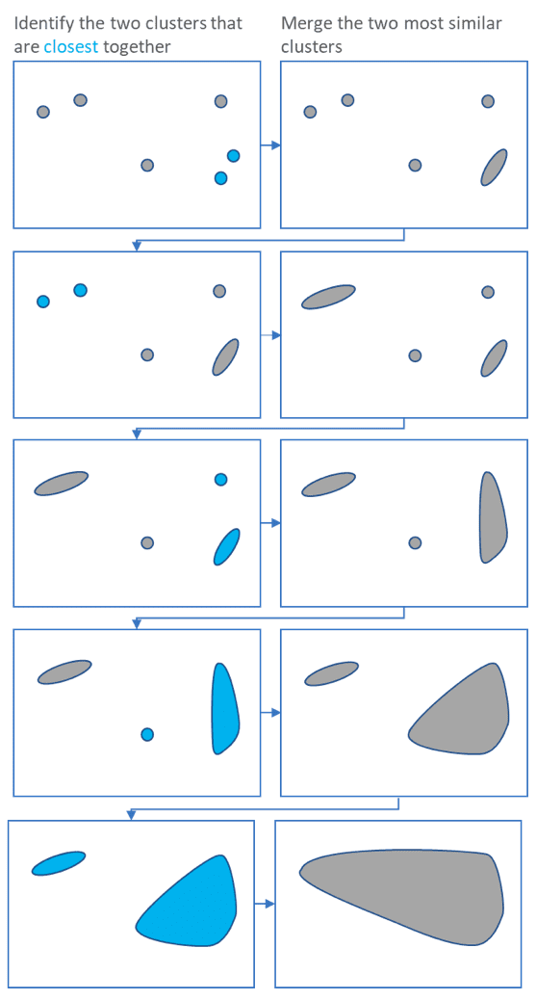
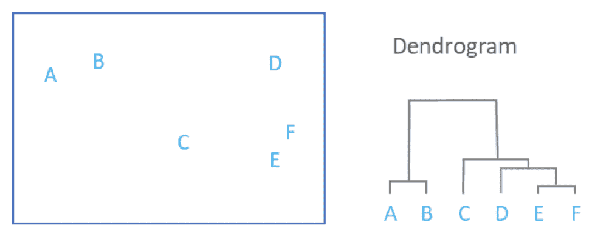

# Classification and Clustering

 

Classification and clustering are types of pattern identification
Classification uses predefined classes that objects within a dataset are assigned to, whereas clustering identifies similarities between objects and groups these together.
Clustering is a method of *unsupervised* learning, as there is only one set of input data that we extract information from without knowing what the output will be
Classification is a type of *supervised* learning as we know the input data and its classes, so we know the possible output of the model.

 

--------------------------------------------------------------------------------

 

# Hierarchical Clustering

- This groups similar objects together in clusters
- It starts by treating each observation as a single cluster
- It then finds the two clusters that are closest together
  - you can do this using a range of different ways to measure the closeness of two clusters
  - for example using the Euclidean distance which is the distance between each cluster computed by drawing a straight line between them
- These two clusters are then merged into one
- This process continues until all clusters are merged together

 

- Finally you are left with a dendrogram that shows a visual representation of the relationship between all the clusters
- The height where two clusters are merged represents the distance between the two clusters

 

- You can also carry this out in the opposite way, where all clusters begin joined together and the clusters are divided up

 

- Advantages: Provides detailed information about which observations are similar
- Disadvantages: Time consuming, so not great for large data sets.

 

Use: 
On data sets where the patterns and similarities are not immediately clear

--------------------------------------------------------------------------------

 

**Sources:**

https://blog.bismart.com/en/classification-vs.-clustering-a-practical-explanation
